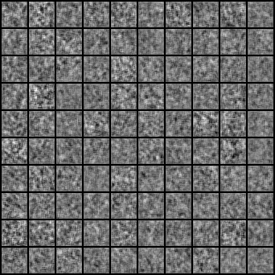

# MindSpore-GAN
<p align="center"></p>

Collection of MindSpore implementations of Generative Adversarial Network varieties presented in research papers. Models are refered to [Pytorch-GAN](https://github.com/eriklindernoren/Pytorch-GAN).

## Table of Contents
  * [Installation](#installation)
  * [Datasets](#datasets)
  * [Implementations](#implementations)
    + [Auxiliary Classifier GAN](#auxiliary-classifier-gan)
    + [Adversarial Autoencoder](#adversarial-autoencoder)
    <!-- + [BEGAN](#began)
    + [BicycleGAN](#bicyclegan)
    + [Boundary-Seeking GAN](#boundary-seeking-gan)
    + [Cluster GAN](#cluster-gan)
    + [Conditional GAN](#conditional-gan)
    + [Context-Conditional GAN](#context-conditional-gan)
    + [Context Encoder](#context-encoder)
    + [Coupled GAN](#coupled-gan)
    + [CycleGAN](#cyclegan)
    + [Deep Convolutional GAN](#deep-convolutional-gan)
    + [DiscoGAN](#discogan)
    + [DRAGAN](#dragan)
    + [DualGAN](#dualgan)
    + [Energy-Based GAN](#energy-based-gan)
    + [Enhanced Super-Resolution GAN](#enhanced-super-resolution-gan) -->
    + [GAN](#gan)
    <!-- + [InfoGAN](#infogan)
    + [Least Squares GAN](#least-squares-gan)
    + [MUNIT](#munit)
    + [Pix2Pix](#pix2pix)
    + [PixelDA](#pixelda)
    + [Relativistic GAN](#relativistic-gan)
    + [Semi-Supervised GAN](#semi-supervised-gan)
    + [Softmax GAN](#softmax-gan)
    + [StarGAN](#stargan)
    + [Super-Resolution GAN](#super-resolution-gan)
    + [UNIT](#unit)
    + [Wasserstein GAN](#wasserstein-gan) -->
    + [Wasserstein GAN GP](#wasserstein-gan-gp)
    <!-- + [Wasserstein GAN DIV](#wasserstein-gan-div) -->

## Installation

```
    $ git clone https://github.com/lvyufeng/MindSpore-GAN
    $ cd MindSpore-GAN/
    $ pip3 install -r requirements.txt
```

## Datasets

Download all datasets for GAN before you try to run the examples.

```bash
$ bash scripts/download_mnist.sh
```

## Implementations

### Auxiliary Classifier GAN
_Auxiliary Classifier Generative Adversarial Network_

#### Authors
Augustus Odena, Christopher Olah, Jonathon Shlens

#### Abstract
Synthesizing high resolution photorealistic images has been a long-standing challenge in machine learning. In this paper we introduce new methods for the improved training of generative adversarial networks (GANs) for image synthesis. We construct a variant of GANs employing label conditioning that results in 128x128 resolution image samples exhibiting global coherence. We expand on previous work for image quality assessment to provide two new analyses for assessing the discriminability and diversity of samples from class-conditional image synthesis models. These analyses demonstrate that high resolution samples provide class information not present in low resolution samples. Across 1000 ImageNet classes, 128x128 samples are more than twice as discriminable as artificially resized 32x32 samples. In addition, 84.7% of the classes have samples exhibiting diversity comparable to real ImageNet data.

[[Paper]](https://arxiv.org/abs/1610.09585) [[Code]](src/acgan/acgan.py)

#### Run Example
```
$ cd src/acgan/
$ python3 acgan.py
```

<p align="center">
    
</p>


### Adversarial Autoencoder
_Adversarial Autoencoder_

#### Authors
Alireza Makhzani, Jonathon Shlens, Navdeep Jaitly, Ian Goodfellow, Brendan Frey

#### Abstract
n this paper, we propose the "adversarial autoencoder" (AAE), which is a probabilistic autoencoder that uses the recently proposed generative adversarial networks (GAN) to perform variational inference by matching the aggregated posterior of the hidden code vector of the autoencoder with an arbitrary prior distribution. Matching the aggregated posterior to the prior ensures that generating from any part of prior space results in meaningful samples. As a result, the decoder of the adversarial autoencoder learns a deep generative model that maps the imposed prior to the data distribution. We show how the adversarial autoencoder can be used in applications such as semi-supervised classification, disentangling style and content of images, unsupervised clustering, dimensionality reduction and data visualization. We performed experiments on MNIST, Street View House Numbers and Toronto Face datasets and show that adversarial autoencoders achieve competitive results in generative modeling and semi-supervised classification tasks.

[[Paper]](https://arxiv.org/abs/1511.05644) [[Code]](src/aae/aae.py)

#### Run Example
```
$ cd src/aae/
$ python3 aae.py
```

### GAN
_Generative Adversarial Network_

#### Authors
Ian J. Goodfellow, Jean Pouget-Abadie, Mehdi Mirza, Bing Xu, David Warde-Farley, Sherjil Ozair, Aaron Courville, Yoshua Bengio

#### Abstract
We propose a new framework for estimating generative models via an adversarial process, in which we simultaneously train two models: a generative model G that captures the data distribution, and a discriminative model D that estimates the probability that a sample came from the training data rather than G. The training procedure for G is to maximize the probability of D making a mistake. This framework corresponds to a minimax two-player game. In the space of arbitrary functions G and D, a unique solution exists, with G recovering the training data distribution and D equal to 1/2 everywhere. In the case where G and D are defined by multilayer perceptrons, the entire system can be trained with backpropagation. There is no need for any Markov chains or unrolled approximate inference networks during either training or generation of samples. Experiments demonstrate the potential of the framework through qualitative and quantitative evaluation of the generated samples.

[[Paper]](https://arxiv.org/abs/1406.2661) [[Code]](src/gan/gan.py)

#### Run Example
```bash
$ cd src/gan/
$ python3 gan.py
```

### Wasserstein GAN GP
_Improved Training of Wasserstein GANs_

#### Authors
Ishaan Gulrajani, Faruk Ahmed, Martin Arjovsky, Vincent Dumoulin, Aaron Courville

#### Abstract
Generative Adversarial Networks (GANs) are powerful generative models, but suffer from training instability. The recently proposed Wasserstein GAN (WGAN) makes progress toward stable training of GANs, but sometimes can still generate only low-quality samples or fail to converge. We find that these problems are often due to the use of weight clipping in WGAN to enforce a Lipschitz constraint on the critic, which can lead to undesired behavior. We propose an alternative to clipping weights: penalize the norm of gradient of the critic with respect to its input. Our proposed method performs better than standard WGAN and enables stable training of a wide variety of GAN architectures with almost no hyperparameter tuning, including 101-layer ResNets and language models over discrete data. We also achieve high quality generations on CIFAR-10 and LSUN bedrooms.

[[Paper]](https://arxiv.org/abs/1704.00028) [[Code]](src/wgan_gp/wgan_gp.py)

#### Run Example
```bash
$ bash scripts/download_mnist.sh
$ cd src/wgan_gp/
$ python3 wgan_gp.py
```